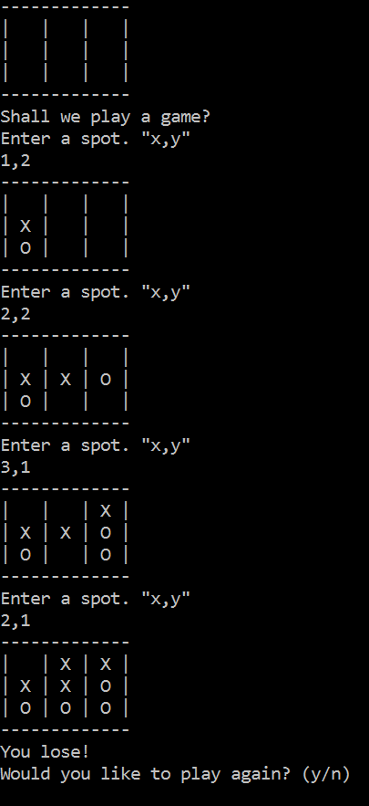

# tictactoe

###Technologies, Frameworks and Programming Languages:
C# ASP.NET, minimax algorithm

###Overview

- A console application of a single player Tic Tac Toe game played vs a computer AI.

- The console displays a simulated board where the player can than select the coordinates or the spot they wish to choose. Example: "(1,3)"

- If victory can not be achieved in a game then the game will end in a "Cat Scratch."

- At the end of each game the player has the option of playing a new game or exiting the application at the end of each game.

###Challenges Faced & Solutions Used: 
The biggest challenge in a tic tac toe game is setting up the AI. For this, I implemented an algorithm works to calculate the best possible move the computer can make. It calculates if a winning move in available and if so makes that move. 

If not the computer picks a spot on the board base on the available positions on the array.

###Error Handling and Troubleshooting:
My primary resource for trouble shooting in this project were the built-in tools in Visual Studio. The ability to set break points and then view the values of variables at various set break points allowed me to see what was going on as the computer was running through different scenarios. 

###Future updates

- I see this game as being a great platform to experiment with functional programming and hope to update the code base in the future. 
